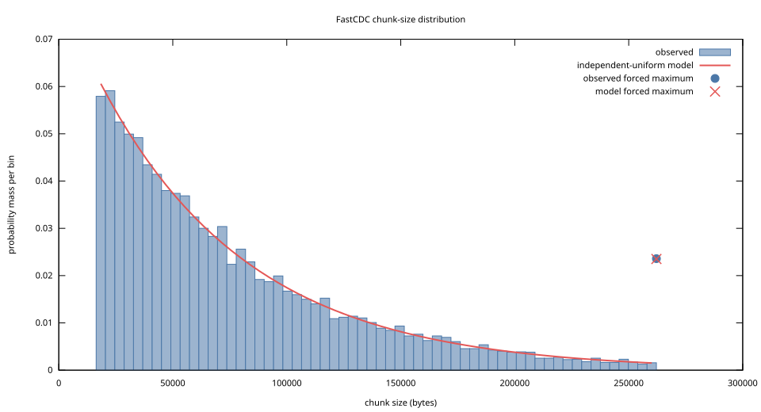
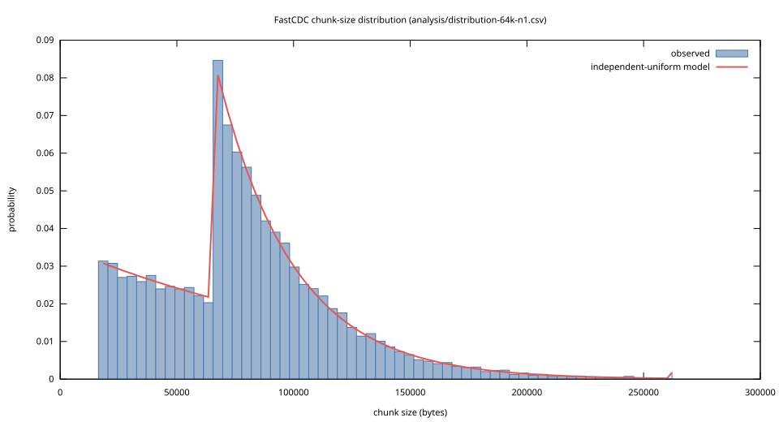
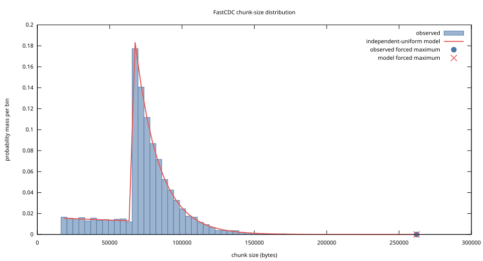
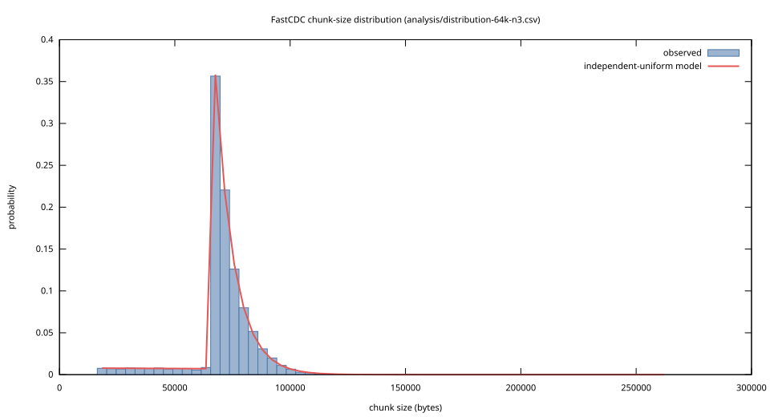

# FastCDC 2020 analysis

These results exercise the implementation on deterministic synthetic data and
four pinned Linux releases. Every Go command used `-race` as a correctness
check.

## Environment

- Go `1.26.5-X:nodwarf5`, `linux/amd64`
- Linux `7.1.5-arch1-2`
- gnuplot `6.0 patchlevel 5`

The source-history inputs are regular files from these exact Git trees:

| Release | Commit | Files | Logical bytes |
| --- | --- | ---: | ---: |
| v6.12 | `adc218676eef25575469234709c2d87185ca223a` | 86,618 | 1,476,498,481 |
| v6.19 | `05f7e89ab9731565d8a62e3b5d1ec206485eeb0b` | 92,112 | 1,549,809,227 |
| v7.0 | `028ef9c96e96197026887c0f092424679298aae8` | 92,939 | 1,568,394,719 |
| v7.1 | `8cd9520d35a6c38db6567e97dd93b1f11f185dc6` | 93,610 | 1,585,431,634 |

## Chunk-size distributions

Each run scanned the same 1 GiB SplitMix64 stream with seed 1, a 64 KiB
configured average, default 16 KiB minimum, and 256 KiB maximum. The final
EOF-shortened chunk was excluded. The analytical result is the two-hazard
independent-uniform-hash model implied by the selected masks.

| Normalization | Complete chunks | Observed mean | Model mean | Total-variation distance |
| --- | ---: | ---: | ---: | ---: |
| None | 13,396 | 80,152.63 B | 80,377.81 B | 0.02330 |
| Level 1 | 13,398 | 80,130.06 B | 79,835.99 B | 0.02111 |
| Level 2 | 14,371 | 74,712.39 B | 74,784.79 B | 0.01797 |
| Level 3 | 15,143 | 70,902.85 B | 70,760.29 B | 0.01327 |

The configured average is the mask-switch point, not a promise that the
arithmetic mean equals that value. The observed means agree with the model to
within 0.45% in all four runs.

| No normalization | Level 1 |
| --- | --- |
| [](distribution-64k-none.svg) | [](distribution-64k-n1.svg) |

| Level 2 | Level 3 |
| --- | --- |
| [](distribution-64k-n2.svg) | [](distribution-64k-n3.svg) |

The underlying measurements are
[none](distribution-64k-none.csv),
[level 1](distribution-64k-n1.csv),
[level 2](distribution-64k-n2.csv), and
[level 3](distribution-64k-n3.csv).

## Linux history deduplication

Every regular file was chunked independently. Boundaries never crossed file
edges, and no tar headers, padding, symlinks, or working-tree files entered the
measurement. Chunk and whole-file identities use SHA-256 plus length.

| Average | Chunk occurrences | Unique chunk payload | Payload saving | Dedup ratio |
| --- | ---: | ---: | ---: | ---: |
| Whole-file baseline | 365,279 files | 3,099,854,411 B | 49.84% | 1.994x |
| 8 KiB | 813,013 | 2,367,039,244 B | 61.70% | 2.611x |
| 64 KiB | 396,111 | 2,926,358,917 B | 52.65% | 2.112x |

The larger format roughly halves the number of chunk occurrences but retains
less edited-file reuse. For v7.0 to v7.1, changed same-path reuse was 46.95%
at 8 KiB and 9.00% at 64 KiB. Global earlier-history reuse in v7.1 was 87.93%
at 8 KiB and 79.80% at 64 KiB; this broader metric also credits unchanged
files, other paths, and releases older than v7.0.

Exact rows are in [linux-history-8k.csv](linux-history-8k.csv) and
[linux-history-64k.csv](linux-history-64k.csv).

## Source-boundary oracle

The v7.0 to v7.1 oracle used the 8 KiB format and included changed same-path
files no larger than 1 MiB in either snapshot.

| Metric | Bytes | Percent |
| --- | ---: | ---: |
| Changed same-path target | 331,867,579 | 100% |
| Oracle-eligible target | 327,263,151 | 98.61% of changed target |
| Ordinary CDC reuse | 151,535,448 | 46.30% of eligible target |
| Fixed-target-partition oracle reuse | 154,323,457 | 47.16% of eligible target |
| Source-boundary loss | 2,788,009 | 1.81% of oracle reuse |

Ordinary CDC captured 98.19% of the bytes found by this oracle. The comparison
is exact: each target FastCDC chunk is byte-matched anywhere in its preceding
same-path source file with a suffix array, while normal reuse requires an equal
source FastCDC chunk. Three changed files totaling 4,604,428 target bytes were
above the cap and are reported rather than extrapolated.

This is not a global theoretical optimum. It keeps the target partition fixed
and excludes other paths, renames, and older snapshots. The exact output is in
[linux-v7.0-v7.1-oracle-8k.csv](linux-v7.0-v7.1-oracle-8k.csv).

## Reproduce

From the repository root:

```sh
go run -race ./cmd/fastcdc-lab distribution \
  -bytes 1GiB -average 64KiB -normalization 1 \
  > analysis/distribution-64k-n1.csv

gnuplot -c cmd/fastcdc-lab/distribution.gnuplot \
  analysis/distribution-64k-n1.csv analysis/distribution-64k-n1.svg
```

For the history runs, set `LINUX_REPO` to the path of a Linux Git checkout and
use the four pinned commits above with
`fastcdc-lab dedup -repo "$LINUX_REPO"`; repeat once with an 8 KiB average and
once with a 64 KiB average. For the oracle, pass only the v7.0 and v7.1
commits together with `-average 8KiB -oracle -oracle-max-file 1MiB`.

Payload savings exclude chunk recipes, hashes, indexes, filenames, modes, and
compression. SHA-256 identities are probabilistic for the aggregate history
metrics; only the oracle byte-compares matches.
